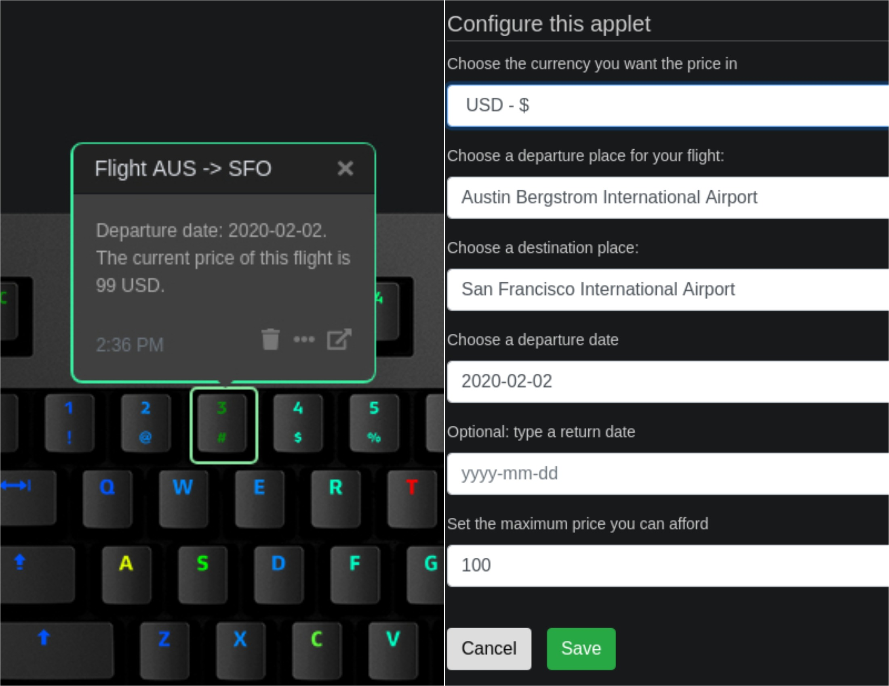

# Q Applet: Flight Price Watcher

This applet will help you to find the best flight prices.

[GitHub repository](https://github.com/daskeyboard/daskeyboard-applet--fly-me)

## Example

Displays a notification on Das Keyboard Q series when there is a cheap flight.
The user has to set a threshold for his flight. In order to do it he has to go on the skyscanner website and check the
average price of the flight. Thereby he will be able to set it on the input designated.
The selected keyboard key will be green or yellow if the price of the flight is under the threshold and orange and red
if not.
When the user will load the applet, the first price collected by the API will be saved in the store during 24 hours and
it will be compared to the prices collected every minutes. Thereby the user will be able to follow the evolution of the
price of his flight for a 24 hours period.
In case the price of the flight is under the threshold: if the price collected every minute is under the price
saved in the store the key will be green, otherwise it will be yellow.
In case the price of the flight is above the threshold: if the price collected every minute is under the price
saved in the store the key will be orange, otherwise it will be red.

## Changelog

[CHANGELOG.MD](CHANGELOG.md)

## Installation

Requires a Das Keyboard Q Series: www.daskeyboard.com

Installation, configuration and uninstallation of applets is done within
the Q Desktop application (<https://www.daskeyboard.com/q>)

## Running tests

Run

    npm test

## Contributions

Pull requests welcome.

## Copyright / License

Copyright 2014 - 2020 Das Keyboard / Metadot Corp.

Licensed under the GNU General Public License Version 2.0 (or later);
you may not use this work except in compliance with the License.
You may obtain a copy of the License in the LICENSE file, or at:

   <http://www.gnu.org/licenses/old-licenses/gpl-2.0.txt>

Unless required by applicable law or agreed to in writing, software
distributed under the License is distributed on an "AS IS" BASIS,
WITHOUT WARRANTIES OR CONDITIONS OF ANY KIND, either express or implied.
See the License for the specific language governing permissions and
limitations under the License.
